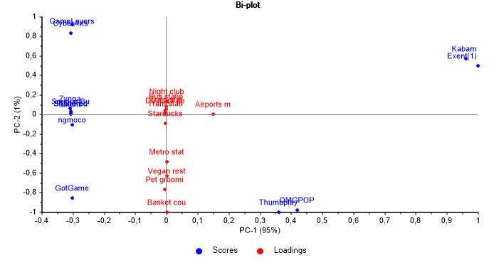

# This is not a game: finding the best location for a recently founded company


A recently created a new company in the GAMING industry will have the following scheme:

- 20 Designers
- 5 UI/UX Engineers
- 10 Frontend Developers
- 15 Data Engineers
- 5 Backend Developers
- 20 Account Managers
- 1 Maintenance guy that loves basketball
- 10 Executives
- 1 CEO/President.

As a data engineer you have asked all the employees to show their preferences on where to place the new office. My goal is to place the new company offices in the best place for the company to grow. 

## 1. Objective

I have to find a place that more or less covers all the following requirements:

- Designers like to go to design talks and share knowledge. There must be some nearby companies that also do design.
- 30% of the company staff have at least 1 child.
- Developers like to be near successful tech startups that have raised at least 1 Million dollars.
- Executives like Starbucks A LOT. Ensure there's a starbucks not too far.
- Account managers need to travel a lot.
- Everyone in the company is between 25 and 40, give them some place to go party.
- The CEO is vegan.
- To make the maintenance guy happy, a basketball stadium must be around 10 Km.
- The office dog—"Dobby" needs a hairdresser every month. Ensure there's one not too far away.

## 2. Data acquistion

The basic data was extracted from the "companies" database located in MongoDB.

The coordinates were extracted with the Foursquare API and appended in a separate dataframe.

## 3. File contents

- data/ --> All csv files extracted from the cleaning and exploratory processes.
- images/ --> Images helpful to explain this project
- src/ --> All the .py and .ipynb files
- README --> What you are reading right now
  
## 4. Function definitions

The first step was to define all the necessary functions to clean my datasets. For example, a function to remove columns would be:


All functions can be found at Functions.py file.

## 5. Data extraction and cleaning
```
The details if this process can be checked in Data_Analayis.ipynb file.
```

The second step was to filter and clean the database from Mongo.

The data was acquiered by using MongoClient for python and collecting the respective database from the local host.

```
from pymongo import MongoClient
```

The filters were applied following the criteria:

- Looking for gaming industries by tags, overview and description,
- With a total monay raise of over $1M

All queries were filtered by using RegEx:

```
filt = {"$and": [{"description":{"$regex": ".*gam.*|.*Gam.*"}, "overview":{"$regex": ".*gam.*|.*Gam.*"}, 
                "total_money_raised":{"$regex": "\$.*B|\$.*M"}, "tag_list":{"$regex": ".*gam.*|.*Gam.*"}}]}

proj = {"description":1, "name":1, "_id":0, "description":1, "overview":1, "tag_list":1, "total_money_raised":1, "offices":1, "number_of_employees":1}

df_regex = pd.DataFrame(coll.find(filt,proj))
```

Later on, the database was cleaned in these steps:

- Displayed all companies located in USA (biggest population of gamedev companies) and located in San Francisco or New York (major density of gamedev companies in USA)
- Cleaned unnecessary columns
- Dropped NaNs
- Converting no-strings to strings
- Exporting the data to CSV

This is the head of the cleaned Mongo-query database, called companies_cleaned, with a total of 12 companies:


## 6. API call, data analysis and cleaning

### Data extraction

The next step was to find the major number of locations (according to the requisites) for each company. This process had to be made externally by calling an API or by doing web-scrap. In this case, the locations were called by using the RESTful from Foursquare.

Two functions were created to extract the data:

- get_tables: it logins to FSQ API and makes url calls based on different categories. Each category corresponds to a requisite, i.e, vegan restaurants, basket courts, airports, etc. The request is made per only 1 item of the companies dataframe. The result of the request is appended to a pandas dataframe and is stored to the data folder.

- extract_categories: it calls get_tables function and extract the files of all the companies in the company dataframe.

The result of both calls is the following. The list continues until reaching the length of the companies dataframe (12 items).


The csv files contain information about all the locations in a radius of 750 meters (except for the airport whic is 10 km), including its coordinates.

### Data manipulation
Following the procedure, it is necessary to obtain the mean distance and the frequency of each csv file. This was performed using the calculate_distances function.

calculate_distances looks for all csv files in the folder that start with a number. Then, it checks if the file is empty or not: if it is, it delivers a warning message with the problematic file. If not, it appends the mean distance and the frequency of all the findings.

```
def calculate_distances(category):
    means = []
    counts = []
    path = os.getcwd()

    for row in range(len(companies)):
        csv_files = glob.glob(os.path.join("../data/", f"{row}{category}.csv"))
        for f in csv_files:
            if os.path.getsize(f) < 100:
                print("These are the csv files without your request:")
                display(f)

            elif os.path.getsize(f) > 100:
                df = pd.read_csv(f)

                means.append(df["distance"].mean())
                counts.append((df["distance"].count()))
    return means, counts
```

Both values are now appended in a new column of the dataframe. This is an example of how the dataframe looks like now:


### Principal component analysis PCA

It is possible to obtain a lot of information about the amount of data I already have. Therefore, a preliminary PCA analysis can be made by obtaining the scores and loadings using The Unscrambler X software:




95% of the variance can be explained in the first PC axis. The scores and loadings don't have any kind of retionship between them. However, they can give us extra hints:

- Some companies are far away from the origin of coordinates. That means, they could be considered as potential outliers.
- Some loadings are farther from the others

The first premise can be confirmed by looking at the hottellings T^2 plot:


Thus, it is possible to confirm that Kabam and Exent (from NY) companies are NOT related with the others. We can deleted those from our dataframe.

### Weighing distances and variables

In order to conclude the winner of this round, it was necessary to attribute a rank to the distances and variables.

For the distances, it is logic to think that if a location is closer, it will get more points. Therefore, the following states were proposed:

- If the distance is between 0 and 200 m, it gets 100 points.
- If the distance is between 200 and 400, it gets 75 points.
- If the distance is between 400 and 600 m, it gets 50 points.
- If the distance is between 600 and 800 m, it gets 25 points.
- If the distance is 0 or beyond 800 m, it gets 0 points.

The punctuations are appended in a new individual column, like this:


The last step is to put a weigh in each variable, which is calculated in function of the number of workforce interested in:

- Vegan restaurant: 6,9 %
- Daycare service: 16,6 %
- Night clubs: 25 %
- Bus, train, metro, tram stations and airport: 12,5 %
- Basket court: 6,9 %
- Pet grooming service: 6,9%
- Starbucks: 25 %

### Who's the winner?

The final ranking will be calculated with the following formula:


Total company score = Item weight 1 * Distance score 1 * Frequency item 1 + Item weight 2 * Distance score 2* Frequency item 2... Item weight 11 * Distance score 11 * Frequency item 11.


The winner is SERIOUS BUSINESS, although only for less than 5 points from the second one, Exent! This is weird, right?

Well, let's see at the visualization of both companies and their surroundings.

## 7. Data visualization & conclusion

Interactive version HERE:

https://nbviewer.org/github/csuoc/third_project_geospatial_data/blob/main/src/Data_Visualization.ipynb

The LIGHT BLUE icons represent both Serious Business and Exent in San Francisco. Look how close they are! This is the explanation why the final scores are very similar.

The blue circle represents an area of radius = 750 m.


Both companies have everything needed in a radius of 750 meters:

- Daycare service for children
- Multiple transport services
- Starbucks. A lot of Starbucks
- And a lot of night clubs to spend the after hours
  
## 8. Links and resources

- https://imedea.uib-csic.es/master/cambioglobal/Modulo_V_cod101615/Theory/mda_theory.pdf